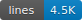
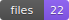

<p align="center">
  
</p>

<h1 align="center">LineHook</h1>

<p align="center">
  <strong>Dynamic code statistics, badges, and graphs for any project</strong><br>
  <em>One command. All the stats. Anywhere you need them.</em>
</p>

<p align="center">
  
  
  
</p>

---

## Quick Start

```bash
# Install globally
npm install -g linehook

# Get instant stats
linehook stats

# That's it!
```

**Example output:**
```
+------------------------------------------------------------+
|                      PROJECT STATISTICS                     |
+------------------------------------------------------------+

  [FILES]
  -------------------------------------
     Total Files:     142
     Text Files:      128
     Binary Files:    14

  [LINES]
  -------------------------------------
     Total Lines:     12,847
     Code Lines:      10,234
     Blank Lines:     2,613

  [ASSETS]
  -------------------------------------
     Total Assets:    14
       Images:        12
       Fonts:         2

  [LANGUAGES]
  -------------------------------------
     TypeScript       ############........   6,420   49.9%
     JavaScript       ####................   2,340   18.2%
     CSS              ###.................   1,890   14.7%
     ...
```

---

## Installation

### NPM (Recommended)
```bash
npm install -g linehook
```

### NPX (No Install)
```bash
npx linehook stats
```

### From Source
```bash
git clone https://github.com/NagusameCS/lineHook.git
cd lineHook
npm install
npm link
```

---

## Commands

### `linehook stats` - Analyze Project

Get comprehensive statistics for your project.

```bash
# Basic usage
linehook stats

# Analyze specific directory
linehook stats --dir ./src

# Only count specific file types
linehook stats --extensions .ts,.tsx,.js

# Exclude directories
linehook stats --exclude tests,fixtures

# Output formats
linehook stats --output table    # Pretty table (default)
linehook stats --output json     # JSON for scripting
linehook stats --output markdown # Markdown for docs
```

**Options:**
| Flag | Description |
|------|-------------|
| `-d, --dir <path>` | Directory to analyze (default: `.`) |
| `-e, --extensions <list>` | File extensions to include |
| `-x, --exclude <list>` | Directories to exclude |
| `-o, --output <format>` | Output format: `table`, `json`, `markdown` |
| `--include-hidden` | Include hidden files |
| `--theme <name>` | Color theme for output |
| `--dark` | Use dark theme |

---

### `linehook badge` - Generate Badges

Create SVG badges for your README.

```bash
# Generate lines badge
linehook badge

# All badge types
linehook badge --type all

# Save to .linehook/badges/
linehook badge --save

# Custom style and color
linehook badge --style for-the-badge --color green

# Use a theme
linehook badge --theme dracula --save

# Quick dark mode
linehook badge --dark --save

# Add icons
linehook badge --icon --save

# Animated badges
linehook badge --animate --save

# Custom label
linehook badge --label "Total Lines" --type lines

# Link to repository
linehook badge --link "https://github.com/user/repo" --save

# Add prefix/suffix to value
linehook badge --prefix "~" --suffix " LOC"

# Output raw SVG
linehook badge --svg
```

**Badge Types:**
| Type | Description |
|------|-------------|
| `lines` | Total line count |
| `code` | Code lines (no blanks) |
| `files` | File count |
| `chars` | Character count |
| `assets` | Asset file count |
| `pages` | HTML page count |
| `languages` | Language count |
| `all` | All badges |

**Styles:** `flat`, `flat-square`, `plastic`, `for-the-badge`, `social`

**Full Options:**
| Flag | Description |
|------|-------------|
| `-t, --type <type>` | Badge type (see above) |
| `-s, --style <style>` | Badge style |
| `-c, --color <color>` | Badge color (hex or name) |
| `-l, --label <text>` | Custom label text |
| `--title <text>` | Custom alt text |
| `--link <url>` | URL to link badge to |
| `--prefix <text>` | Text before value |
| `--suffix <text>` | Text after value |
| `--label-color <color>` | Custom label background |
| `--theme <name>` | Color theme |
| `--dark` | Use dark theme |
| `--icon` | Include icon |
| `--animate` | Add animation |
| `--svg` | Output raw SVG |
| `--save` | Save to file |

**Add to README:**
```markdown


```

---

### `linehook graph` - Generate Graphs

Create visual charts for your statistics.

```bash
# Summary card
linehook graph --type summary --output stats.svg

# Language pie chart
linehook graph --type pie --output languages.svg

# Bar chart
linehook graph --type bars --output breakdown.svg

# Treemap visualization
linehook graph --type treemap --output treemap.svg

# All charts (dashboard)
linehook graph --type dashboard --output charts.svg

# Custom dimensions
linehook graph --width 800 --height 600 --output chart.svg

# With theme
linehook graph --theme dracula --type summary -o stats-dark.svg

# Quick dark mode
linehook graph --dark --type pie -o languages-dark.svg

# Custom title
linehook graph --title "My Project Stats" --type summary -o stats.svg

# With subtitle and footer
linehook graph --title "Stats" --subtitle "Generated by LineHook" -o stats.svg

# Link the graph to repo
linehook graph --link "https://github.com/user/repo" -o stats.svg
```

**Graph Types:**
| Type | Description |
|------|-------------|
| `summary` | Stats overview card |
| `pie` | Language pie chart |
| `bars` | Horizontal bar chart |
| `treemap` | Language treemap |
| `breakdown` | Same as bars |
| `dashboard` | All charts |

**Full Options:**
| Flag | Description |
|------|-------------|
| `-t, --type <type>` | Graph type (see above) |
| `-o, --output <file>` | Output file path |
| `--title <text>` | Custom title |
| `--subtitle <text>` | Custom subtitle |
| `--footer <text>` | Custom footer text |
| `--link <url>` | URL to link graph to |
| `--hide-title` | Hide the title |
| `--theme <name>` | Color theme |
| `--dark` | Use dark theme |
| `--width <pixels>` | Graph width |
| `--height <pixels>` | Graph height |

---

### `linehook init` - Initialize Project

Set up LineHook in your project with config and optional GitHub Action.

```bash
# Basic init
linehook init

# With GitHub Action for auto-updates
linehook init --github-action
```

**Creates:**
```
.linehook/
  config.json       # Configuration
  badges/           # Generated badges
  stats.json        # Cached stats
```

---

### `linehook webhook` - Real-time Updates

Manage webhooks and local development server.

```bash
# Start local server (great for development)
linehook webhook --serve

# Manually update all badges
linehook webhook --update

# Show setup options
linehook webhook --setup
```

**Local Server Endpoints:**
```
GET  /stats           -> JSON stats
GET  /badge/lines     -> Lines badge SVG
GET  /badge/files     -> Files badge SVG
GET  /badge/chars     -> Characters badge SVG
GET  /graph/summary   -> Summary card SVG
POST /webhook         -> GitHub webhook receiver
```

**Live Badge URL:**
```markdown

```

---

## How Updates Work

LineHook supports two modes: **Offline** (manual updates) and **Auto** (GitHub Actions). When you run `linehook init`, you'll be asked which mode you prefer.

### Offline Mode (Manual Updates)

Badges are static SVG files stored in your repository. They **never expire** and don't require any server.

```bash
# Initialize in offline mode
linehook init --offline

# Update workflow (run whenever you want to refresh stats)
linehook badge --save
linehook graph --type summary -o .linehook/stats.svg
git add .linehook/
git commit -m "Update stats"
git push
```

**Pros:**
- No server needed - badges work forever
- Full control over when stats update
- Works with any Git hosting (GitHub, GitLab, Bitbucket)

### Auto Mode (GitHub Actions)

Badges update automatically on every push using GitHub Actions - **runs on GitHub's servers, not yours**.

```bash
# Initialize with auto-updates
linehook init --auto
```

This creates `.github/workflows/linehook.yml` which:
1. Runs on every push to main/master
2. Regenerates all badges and graphs
3. Commits the updated files back to the repo

**Key Point:** This is NOT a webhook that requires your computer to be on. GitHub Actions runs on GitHub's infrastructure - it's always available and completely free for public repos.

**Pros:**
- Fully automatic - stats update on every push
- Runs on GitHub's servers (free, always-on)
- No external services or API keys needed

### Local Development Server

For real-time badges during development:

```bash
linehook webhook --serve
```

This starts a local server that generates fresh badges on each request. Useful for development/testing, but **not for production** - it stops when your computer turns off.

### Q: Will badges break if my computer turns off?

**No!** LineHook generates static SVG files that are stored in your repository. They're just regular files - like images. They work as long as your repo exists.

- **Offline Mode**: Badges are static files you commit. They never change until you manually update them.
- **Auto Mode**: GitHub Actions updates the files for you. It runs on GitHub's servers, not yours.

Neither mode requires your computer, an external server, or a webhook service to keep working.

---

## What Gets Counted

### Included
- All text-based source files
- Code lines (non-blank)
- Blank lines
- Characters (with/without whitespace)
- 50+ programming languages detected

### Excluded
- Binary files (images, videos, fonts, etc.)
- `node_modules`, `.git`, `vendor`, `dist`, `build`
- Lock files (`package-lock.json`, `yarn.lock`, etc.)
- Minified files (`*.min.js`, `*.min.css`)

### Asset Tracking
- Images (png, jpg, gif, svg, webp, etc.)
- Videos (mp4, mov, avi, etc.)
- Audio (mp3, wav, flac, etc.)
- Fonts (ttf, woff, woff2, etc.)
- Documents (pdf, docx, etc.)

### Page Detection
- `index.html`, `index.htm`
- Next.js `page.tsx`, `page.jsx`
- Other index files

---

## Configuration

Create `.linehook/config.json`:

```json
{
  "version": "1.0.0",
  "theme": "default",
  "directories": ["."],
  "extensions": [],
  "exclude": [
    "node_modules",
    ".git",
    "dist",
    "coverage"
  ],
  "badges": {
    "style": "flat",
    "color": "blue",
    "link": "https://github.com/user/repo"
  },
  "graphs": {
    "width": 600,
    "height": 400,
    "title": "Project Statistics"
  }
}
```

---

## Themes and Dark Mode

LineHook supports **12 beautiful themes** including dark mode variants.

### Available Themes

**Light Themes:**
- `default` - Classic blue theme
- `github` - GitHub's light theme

**Dark Themes:**
- `dark` - Universal dark theme
- `githubDark` - GitHub's dark mode
- `dracula` - Popular Dracula palette
- `monokai` - Classic Monokai colors
- `nord` - Arctic, north-bluish palette
- `tokyoNight` - Tokyo Night editor theme
- `catppuccin` - Soothing pastel theme
- `neon` - Vibrant neon colors
- `sunset` - Warm sunset gradients
- `ocean` - Deep ocean blues

### Using Themes

```bash
# List all available themes
linehook theme --list

# Preview a theme's colors
linehook theme --preview dracula

# Generate badges with a theme
linehook badge --theme dracula --save

# Generate graphs with a theme
linehook graph --theme githubDark --type summary -o stats.svg

# Quick dark mode shortcut
linehook badge --dark
linehook graph --dark --type pie -o pie.svg
```

### Set Default Theme

```bash
# Set theme for all future commands
linehook theme --set catppuccin
```

---

## Integration Examples

### GitHub README

```markdown
<!-- Static badges (generated and committed) -->


<!-- Stats card -->

```

### CI/CD Integration

```yaml
# .github/workflows/stats.yml
name: Update Stats
on:
  push:
    branches: [main]

jobs:
  update:
    runs-on: ubuntu-latest
    steps:
      - uses: actions/checkout@v4
      - uses: actions/setup-node@v4
        with:
          node-version: '20'
      - run: npm install -g linehook
      - run: linehook badge --save
      - run: linehook graph --type summary -o .linehook/stats.svg
      - run: |
          git config user.name "GitHub Action"
          git config user.email "action@github.com"
          git add .linehook/
          git diff --staged --quiet || git commit -m "Update stats"
          git push
```

### Script Usage

```bash
#!/bin/bash
# update-stats.sh

linehook badge --theme dark --save
linehook graph --theme dark --type summary -o .linehook/stats.svg
linehook stats --output json > .linehook/stats.json

echo "Stats updated!"
```

### Programmatic Usage

```javascript
const { 
  StatsEngine, 
  BadgeGenerator, 
  GraphGenerator, 
  ThemeManager 
} = require('linehook');

// Get stats
const engine = new StatsEngine({ dir: './src' });
const stats = await engine.analyze();

console.log(`Lines: ${stats.totalLines}`);
console.log(`Files: ${stats.textFiles}`);

// Generate badge with theme and link
const badge = new BadgeGenerator({ 
  style: 'flat',
  theme: 'dracula',
  link: 'https://github.com/user/repo'
});
const svg = badge.generate('lines', stats.totalLines, { 
  statType: 'lines'
});

// Generate graph with custom title
const graph = new GraphGenerator({ 
  width: 600,
  theme: 'githubDark',
  title: 'My Project Stats'
});
const chart = graph.generateBarChart(stats);

// Work with themes directly
const themes = ThemeManager.getThemes();
console.log('Available themes:', themes.map(t => t.id));
```

---

## Comparison

| Feature | LineHook | tokei/cloc | Other Services |
|---------|----------|------------|----------------|
| **One-command install** | Yes | Yes | Often complex |
| **Badge generation** | Yes | No | Yes |
| **Graph generation** | Yes | No | Varies |
| **Asset counting** | Yes | No | No |
| **Page detection** | Yes | No | No |
| **Works offline** | Yes | Yes | No |
| **No server needed** | Yes | Yes | No |
| **Theme support** | 12 themes | No | Limited |
| **Dark mode** | Yes | No | Some |
| **Custom labels** | Yes | N/A | Some |
| **Repo linking** | Yes | N/A | Some |
| **JSON output** | Yes | Yes | Varies |
| **Local dev server** | Yes | No | No |

---

## Similar Projects and Alternatives

### Code Counting Tools
- **[tokei](https://github.com/XAMPPRocky/tokei)** - Blazing fast Rust-based line counter
- **[cloc](https://github.com/AlDanial/cloc)** - Count Lines of Code in Perl
- **[scc](https://github.com/boyter/scc)** - Sloc Cloc and Code in Go
- **[loc](https://github.com/cgag/loc)** - Fast Rust line counter

### Badge Services
- **[Shields.io](https://shields.io)** - Dynamic badge generation service
- **[Badgen](https://badgen.net)** - Fast badge service

### GitHub Stats
- **[GitHub Readme Stats](https://github.com/anuraghazra/github-readme-stats)** - Beautiful GitHub stats cards
- **[WakaTime](https://wakatime.com)** - Code time tracking with badges

### Why LineHook?
- Fast like tokei/scc
- Beautiful like GitHub Readme Stats
- Self-contained - no external services needed
- Flexible - CLI, library, webhook, GitHub Action
- Theme support with 12+ color palettes including dark mode
- Custom labels, links, and styling options

---

## Contributing

Contributions welcome!

```bash
git clone https://github.com/NagusameCS/lineHook.git
cd lineHook
npm install
npm link

# Test locally
linehook stats
```

---

## License

MIT (c) [NagusameCS](https://github.com/NagusameCS)

---

<p align="center">
  <strong>Star this repo if LineHook helps your projects!</strong>
</p>
